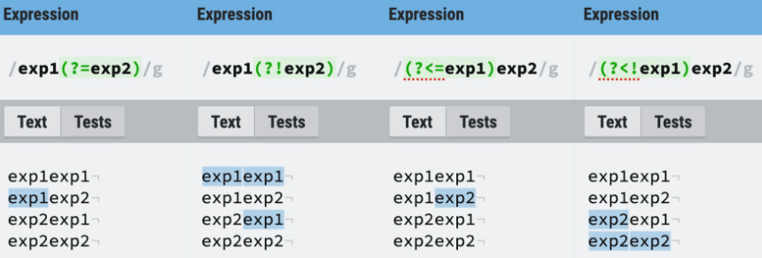
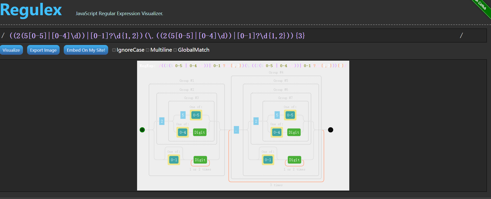

# 正则表达式入门


## 起因 -- 一个问题

在正式工作之前，我对正则表达式的匹配也是早就听闻其强大的文本匹配能力，但是没有实际操作过。

在我接手工作代码之后，我也实际用了一小部分正则的功能，深感其精炼强大，不过也是随用随学，不够完整。

在对C++和Perl的进一步学习过程中，发现C++11将支持正则表达式作为一大新特性进行强调（C++ primer 5th 17.3），而Perl作为强大的"实用报表提取语言"(Practical Extraction and Report Language)，它的正则表达式功能基本上是常用语言中最强大的，很多语言设计正则式支持的时候都参考Perl的正则表达式。

最近工作中，一位同事在阅读代码时发现一个困难。

代码如下：

```c#
if (FilePath.IsNotNullOrEmpty())
{
	string pattern = @"((2(5[0-5]|[0-4]\d))|[0-1]?\d{1,2})(\.((2(5[0-5]|[0-4]\d))|[0-1]?\d{1,2})){3}";
	bool isSharedFolder = Regex.IsMatch(FilePath, pattern);
	if (isSharedFolder == false)
	{
		string p = Path.GetDirectoryName(FilePath);
		...
		return;
	}

	SaveOR(outputFilePath);
	MessageBox.Show("导出完成");
}
```

可以看出这是一段导出文件的代码，而它阅读的困难就在于第3行的字符串匹配中。可以看出字符串使用了正则匹配。

```c#
string pattern = @"((2(5[0-5]|[0-4]\d))|[0-1]?\d{1,2})(\.((2(5[0-5]|[0-4]\d))|[0-1]?\d{1,2})){3}";
```

利用已经快遗忘的正则知识加上一些查找辅助，帮助了同事理解了之后，我也深感自己知识记得不牢，便有了把正则再系统学习一下的念头。

故做此笔记记录之。

**参考资料是** 

- 菜鸟教程
- 《学习正则表达式》 Micbael Fitzgerald著，王热宇译。

- 《精通正则表达式（第3版）》Jeffrey E. F. Friedl 著，余晟译


## 一、正则表达式的历史

### 译名问题

Regular Expression的Regular一般被译为**正则**、**正规**或**常规**。

此处的Regular即是**规则**、**规律**的意思，Regular Expression即“描述某种规则的[表达式](https://zh.wikipedia.org/wiki/表达式)”之意。

### 历史与流派

最初的正则表达式出现于[理论计算机科学](https://zh.wikipedia.org/wiki/理论计算机科学)的[自动控制](https://zh.wikipedia.org/wiki/自动控制)理论和[形式化语言](https://zh.wikipedia.org/wiki/形式化语言)理论中。在这些领域中有对计算（自动控制）的模型和对[形式化语言](https://zh.wikipedia.org/wiki/形式化语言)描述与分类的研究。

1940年，[沃伦·麦卡洛克](https://zh.wikipedia.org/wiki/沃伦·麦卡洛克)与[沃尔特·皮茨](https://zh.wikipedia.org/wiki/沃尔特·皮茨)将[神经系统](https://zh.wikipedia.org/wiki/神经系统)中的神经元描述成小而简单的自动控制元。

1950年代，数学家[斯蒂芬·科尔·克莱尼](https://zh.wikipedia.org/wiki/斯蒂芬·科尔·克莱尼)利用称之为“正则集合”的数学符号来描述此模型。[肯·汤普逊](https://zh.wikipedia.org/wiki/肯·汤普逊)将此符号系统引入编辑器[QED](https://zh.wikipedia.org/w/index.php?title=QED_(文字編輯器)&action=edit&redlink=1)，随后是[Unix](https://zh.wikipedia.org/wiki/Unix)上的编辑器[ed](https://zh.wikipedia.org/wiki/Ed_(文本编辑器))，并最终引入[grep](https://zh.wikipedia.org/wiki/Grep)。自此以后，正则表达式被广泛地应用于各种Unix或[类Unix](https://zh.wikipedia.org/wiki/类Unix)系统的工具中。

正则表达式的POSIX规范，分为**基本型正则表达式**（Basic Regular Expression，BRE）和**扩展型正则表达式**（Extended Regular Expression，ERE）两大流派。

在兼容POSIX的UNIX系统上，grep和egrep之类的工具都遵循POSIX规范，一些数据库系统中的正则表达式也匹配POSIX规范。grep、vi、sed都属于BRE，是历史最早的正则表达式，因此元字符必须转译之后才具有特殊含义。egrep、awk则属于ERE，元字符不用转译

Perl的正则表达式源自于[Henry Spencer](https://zh.wikipedia.org/w/index.php?title=Henry_Spencer&action=edit&redlink=1)于1986年1月19日发布的regex，它已经演化成了PCRE（Perl兼容正则表达式，[Perl Compatible Regular Expressions](https://zh.wikipedia.org/w/index.php?title=Perl_Compatible_Regular_Expressions&action=edit&redlink=1)），一个由[Philip Hazel](https://zh.wikipedia.org/w/index.php?title=Philip_Hazel&action=edit&redlink=1)开发的，为很多现代工具所使用的库。

### 参考阅读

[Linux/Unix 工具与正则表达式的 POSIX 规范](https://blog.51cto.com/kk5234/638752)


## 二、语法快速入门

为了方便查阅与快读入门，先将正则表达式最常用的功能列举如下

### 普通字符

所有不是元字符的字符都可以直接写出来用来匹配，比如大小写字母、数字、符号等

有语法意义的字符需要使用 \ 转义，比如 \\( \\) \\[ \\] \\. 分别匹配 ()[]. 这五个字符

| 语法   | 描述                                                         |
| :----- | :----------------------------------------------------------- |
| [...]  | 匹配任意在 `...` 中的字符，如 [ABC] 匹配所有 A B C 字符      |
| [\^...] | 匹配任意不在 `...` 中的字符，如 [\^ABC] 匹配除了 A B C 外的所有单个字符 |
| [x-y]  | 按照顺序匹配从 `x` 到 `y` 到所有字符，如 [a-z] 匹配所有小写字母，[A-E] 匹配 A 到 E 这五个字符｜ |
| .      | 匹配任意除了换行符以外的字符                                 |
| \w     | 匹配字母数字下划线，相当于 [a-zA-Z0-9_]                      |
| x\|y   | 匹配 `x` 或 `y`，优先级最低，如 `a|bcd` 匹配 a 或 bcd        |

### 非打印字符
| 语法 | 描述                                                         |
| :--- | :----------------------------------------------------------- |
| \cx  | 匹配由 x 指明的控制字符，x 必须属于 [a-zA-Z]，否则 \c 直接视为 c，如 \cM 匹配 Ctrl-M 即回车符 |
| \f   | 匹配一个换页符，相当于 \x0c \cL                              |
| \n   | 匹配一个换行符，相当于 \x0a \cJ                              |
| \r   | 匹配一个回车符，相当于 \x0d \cM                              |
| \t   | 匹配一个制表符，相当于 \x09 \cI                              |
| \v   | 匹配一个垂直制表符，相当于 \x0b \cK                          |
| \s   | 匹配任何空白字符，相当于 [ \f\n\r\t\v]，unicode 下也会匹配全角空格符 |
| \S   | 匹配任何非空白符，相当于 [\^ \f\n\r\t\v]                      |

### 限定符
用来指定一个子表达式出现了多少次

| 语法  | 描述                                                         |
| :---- | :----------------------------------------------------------- |
| {n}   | 前一个子表达式匹配准确的 n 次，如 o{2} 匹配两个连续的 o      |
| {n,}  | 前一个子表达式匹配至少 n 次，如 o{2,} 可以匹配 goooood 中的所有 o，但不匹配 god 中的 o |
| {n,m} | 前一个子表达式匹配至少 n 次，至多 m 次                       |
| *     | 前一个子表达式匹配 0 次或多次，相当于 {0,}                   |
| +     | 前一个子表达式匹配 1 次或多次，相当于 {1,}                   |
| ?     | 前一个子表达式可有可无（匹配 0 次或 1 次），相当于 {0,1}     |

#### :star:贪婪
\* 和 + 的匹配都是贪婪的，即尽可能匹配更多的字符，而在它们后面加上 ? 就可以非贪婪（即最小匹配）

- <.*> 会匹配整个 `<h1>header</h1>` 字符串
- <.*?> 只会匹配其中的 `<h1>` 和 `</h1>`

### 定位符
只匹配位置，没有字符与之对应

| 语法 | 描述                                                     |
| :--- | :------------------------------------------------------- |
| ^    | 匹配字符串开头，如果是多行模式，则新的一行也算新的字符串 |
| $    | 匹配字符串结尾，多行模式同理看成多个字符串               |
| \b   | 匹配单词边界，即字符与空格中间的位置                     |
| \B   | 匹配非单词边界                                           |

定位符只能单独使用，不能附加限制符指定个数

### 分组
用 () 可以指定匹配一个组，使用 () 可以指定不同选项，每一项间用 | 分隔

同时 () 也是捕获分组，即括号内匹配的内容会被缓存，如果要避免这种，需要使用 (?:) 非捕获元来进行匹配

#### 反向引用
被缓存的捕获分组可以直接使用 \n 再次引用，其中 n 是 1 到 2 位的十进制数<br/>
捕获分组的编号从 1 开始，最多 99 个，\1 即表示和第一个圆括号中匹配的结果相同的部分

如 (abc|def)\1 匹配 abcabc、defdef 但不匹配 abcdef、defabc

#### 先行断言和后行断言
正则表达式有先行断言（lookahead）和后行断言（lookbehind），分为四种形式：

|     语法     |                             名称                             |
| :----------: | :----------------------------------------------------------: |
| (?=pattern)  | 零宽正向先行断言<br/>zero-width positive lookahead assertion |
| (?!pattern)  | 零宽负向先行断言<br/>zero-width negative lookahead assertion |
| (?<=pattern) | 零宽正向后行断言<br/>zero-width positive lookbehind assertion |
| (?<!pattern) | 零宽负向后行断言<br/>zero-width negative lookbehind assertion |

和定位符类似，它只匹配位置，不匹配内容，所以叫做零宽（zero-width），这些位置的规则是

- (?=pattern)：匹配后面可以匹配 pattern 的位置

- (?!pattern)：匹配后面无法匹配 pattern 的位置

- <span style="font-variant-ligatures: none;">(?<=pattern)</span>：匹配前面可以匹配 pattern 的位置

- (?<!pattern)：匹配前面无法匹配 pattern 的位置

  ####  example "例子"

  

  

  其中后行断言有些语言不支持（python re 支持)

  ## 修饰符
  修饰符不属于表达式的内容，但是指定了匹配的规则，js 中的正则写法为 /pattern/flags<br/>
  其中 flags 就是修饰符

  | 修饰符 | 名称        | 含义                                           |
  | :----- | :---------- | :--------------------------------------------- |
  | i      | ignore      | 忽略大小写                                     |
  | g      | global      | 全局匹配，查找所有匹配项                       |
  | m      | multi-line  | 多行匹配，使 ^$ 匹配每行的开头和结尾           |
  | s      | single-line | 单行匹配，只视为一个字符串，. 也可以匹配换行符 |

  不同语言中写法和种类不同

  ## 优先级
  正则表达式也有优先级，同一优先级则从左向右运算，不同优先级则从高到低。从高到低：

  - 转义符 `\`
  - 括号符 `(...) (?:...) (?=...) (?!...) (?<=...) (?<!...) [...] [^...]`
  - 限定符 `* + ? {n} {n,} {n,m}`
  - 定位符 `^ $`
  - 字符
  - 或 `|`


## Appendix 1 推荐网站

1. [菜鸟教程-正则表达式](https://www.runoob.com/regexp/regexp-tutorial.html)
1. [Reg101 正则在线测试工具1](https://regex101.com/)
2. [RegExr 正则在线测试工具2](https://regexr.com/)
3. [:star:Regulex 正则表达式可视化](https://jex.im/regulex/)
4. [HackerRank regex 习题集](https://www.hackerrank.com/domains/regex)

个人强推第四个，网站通过JavaScript，很好的将正则表达式可视化。

如我们开头遇到的那个很复杂的表达式，经过可视化后就可以看的很清楚。



## Appendix2 常用正则表达式

这里用Typora或者vscode看会有问题，建议使用浏览器看https://github.com/TXC-ALON/LearningRegex/blob/main/LearningRegex/LearningRegex.md，或者直接复制代码。

### 一、校验数字的表达式

- 数字：**^[0-9]\*$**
- n位的数字：**^\d{n}$**
- 至少n位的数字**：^\d{n,}$**
- m-n位的数字：**^\d{m,n}$**
- 零和非零开头的数字：**^(0|[1-9][0-9]\*)$**
- 非零开头的最多带两位小数的数字：**^([1-9][0-9]\*)+(\.[0-9]{1,2})?$**
- 带1-2位小数的正数或负数：**^(\-)?\d+(\.\d{1,2})$**
- 正数、负数、和小数：**^(\-|\+)?\d+(\.\d+)?$**
- 有两位小数的正实数：**^[0-9]+(\.[0-9]{2})?$**
- 有1~3位小数的正实数：**^[0-9]+(\.[0-9]{1,3})?$**
- 非零的正整数：**^[1-9]\d\*$ 或 ^([1-9][0-9]\*){1,3}$ 或 ^\+?[1-9][0-9]\*$**
- 非零的负整数：**^\-[1-9][]0-9"\*$ 或 ^-[1-9]\d\*$**
- 非负整数：**^\d+$ 或 ^[1-9]\d\*|0$**
- 非正整数：**^-[1-9]\d\*|0$ 或 ^((-\d+)|(0+))$**
- 非负浮点数：**^\d+(\.\d+)?$ 或 ^[1-9]\d\*\.\d\*|0\.\d\*[1-9]\d\*|0?\.0+|0$**
- 非正浮点数：**^((-\d+(\.\d+)?)|(0+(\.0+)?))$ 或 ^(-([1-9]\d\*\.\d\*|0\.\d\*[1-9]\d\*))|0?\.0+|0$**
- 正浮点数：**^[1-9]\d\*\.\d\*|0\.\d\*[1-9]\d\*$ 或 ^(([0-9]+\.[0-9]\*[1-9][0-9]\*)|([0-9]\*[1-9][0-9]\*\.[0-9]+)|([0-9]\*[1-9][0-9]\*))$**
- 负浮点数：**^-([1-9]\d\*\.\d\*|0\.\d\*[1-9]\d\*)$ 或 ^(-(([0-9]+\.[0-9]\*[1-9][0-9]\*)|([0-9]\*[1-9][0-9]\*\.[0-9]+)|([0-9]\*[1-9][0-9]\*)))$**
- 浮点数：**^(-?\d+)(\.\d+)?$ 或 ^-?([1-9]\d\*\.\d\*|0\.\d\*[1-9]\d\*|0?\.0+|0)$**


### 二、校验字符的表达式

- 汉字：**^[\u4e00-\u9fa5]{0,}$**
- 英文和数字：**^[A-Za-z0-9]+$ 或 ^[A-Za-z0-9]{4,40}$**
- 长度为3-20的所有字符：**^.{3,20}$**
- 由26个英文字母组成的字符串：**^[A-Za-z]+$**
- 由26个大写英文字母组成的字符串：**^[A-Z]+$**
- 由26个小写英文字母组成的字符串：**^[a-z]+$**
- 由数字和26个英文字母组成的字符串：**^[A-Za-z0-9]+$**
- 由数字、26个英文字母或者下划线组成的字符串：**^\w+$ 或 ^\w{3,20}$**
- 中文、英文、数字包括下划线：**^[\u4E00-\u9FA5A-Za-z0-9_]+$**
- 中文、英文、数字但不包括下划线等符号：**^[\u4E00-\u9FA5A-Za-z0-9]+$ 或 ^[\u4E00-\u9FA5A-Za-z0-9]{2,20}$**
- 可以输入含有^%&',;=?$\"等字符：**[^%&',;=?$\x22]+**
- 禁止输入含有~的字符：**[^~]+**

------

### 三、特殊需求表达式

- Email地址：**^\w+([-+.]\w+)\*@\w+([-.]\w+)\*\.\w+([-.]\w+)\*$**
- 域名：**[a-zA-Z0-9][-a-zA-Z0-9]{0,62}(\.[a-zA-Z0-9][-a-zA-Z0-9]{0,62})+\.?**
- InternetURL：**[a-zA-z]+://[^\s]\* 或 ^http://([\w-]+\.)+[\w-]+(/[\w-./?%&=]\*)?$**
- 手机号码：**^(13[0-9]|14[01456879]|15[0-35-9]|16[2567]|17[0-8]|18[0-9]|19[0-35-9])\d{8}$**
- 电话号码("XXX-XXXXXXX"、"XXXX-XXXXXXXX"、"XXX-XXXXXXX"、"XXX-XXXXXXXX"、"XXXXXXX"和"XXXXXXXX)：**^(\(\d{3,4}-)|\d{3.4}-)?\d{7,8}$**
- 国内电话号码(0511-4405222、021-87888822)：**\d{3}-\d{8}|\d{4}-\d{7}**
- 电话号码正则表达式（支持手机号码，3-4位区号，7-8位直播号码，1－4位分机号）: **((\d{11})|^((\d{7,8})|(\d{4}|\d{3})-(\d{7,8})|(\d{4}|\d{3})-(\d{7,8})-(\d{4}|\d{3}|\d{2}|\d{1})|(\d{7,8})-(\d{4}|\d{3}|\d{2}|\d{1}))$)**
- 身份证号(15位、18位数字)，最后一位是校验位，可能为数字或字符X：**(^\d{15}$)|(^\d{18}$)|(^\d{17}(\d|X|x)$)**
- 帐号是否合法(字母开头，允许5-16字节，允许字母数字下划线)：**^[a-zA-Z][a-zA-Z0-9_]{4,15}$**
- 密码(以字母开头，长度在6~18之间，只能包含字母、数字和下划线)：**^[a-zA-Z]\w{5,17}$**
- 强密码(必须包含大小写字母和数字的组合，不能使用特殊字符，长度在 8-10 之间)：**^(?=.\*\d)(?=.\*[a-z])(?=.\*[A-Z])[a-zA-Z0-9]{8,10}$**
- 强密码(必须包含大小写字母和数字的组合，可以使用特殊字符，长度在8-10之间)：**^(?=.\*\d)(?=.\*[a-z])(?=.\*[A-Z]).{8,10}$**
- 日期格式：**^\d{4}-\d{1,2}-\d{1,2}**
- 一年的12个月(01～09和1～12)：**^(0?[1-9]|1[0-2])$**
- 一个月的31天(01～09和1～31)：**^((0?[1-9])|((1|2)[0-9])|30|31)$**
- 钱的输入格式：
  1. 有四种钱的表示形式我们可以接受:"10000.00" 和 "10,000.00", 和没有 "分" 的 "10000" 和 "10,000"：**^[1-9][0-9]\*$**
  2. 这表示任意一个不以0开头的数字,但是,这也意味着一个字符"0"不通过,所以我们采用下面的形式：**^(0|[1-9][0-9]\*)$**
  3. 一个0或者一个不以0开头的数字.我们还可以允许开头有一个负号：**^(0|-?[1-9][0-9]\*)$**
  4. 这表示一个0或者一个可能为负的开头不为0的数字.让用户以0开头好了.把负号的也去掉,因为钱总不能是负的吧。下面我们要加的是说明可能的小数部分：**^[0-9]+(.[0-9]+)?$**
  5. 必须说明的是,小数点后面至少应该有1位数,所以"10."是不通过的,但是 "10" 和 "10.2" 是通过的：**^[0-9]+(.[0-9]{2})?$**
  6. 这样我们规定小数点后面必须有两位,如果你认为太苛刻了,可以这样：**^[0-9]+(.[0-9]{1,2})?$**
  7. 这样就允许用户只写一位小数.下面我们该考虑数字中的逗号了,我们可以这样：**^[0-9]{1,3}(,[0-9]{3})\*(.[0-9]{1,2})?$**
  8. 1到3个数字,后面跟着任意个 逗号+3个数字,逗号成为可选,而不是必须：**^([0-9]+|[0-9]{1,3}(,[0-9]{3})\*)(.[0-9]{1,2})?$**
  9. 备注：这就是最终结果了,别忘了"+"可以用"*"替代如果你觉得空字符串也可以接受的话(奇怪,为什么?)最后,别忘了在用函数时去掉去掉那个反斜杠,一般的错误都在这里
- xml文件：**^([a-zA-Z]+-?)+[a-zA-Z0-9]+\\.[x|X][m|M][l|L]$**
- 中文字符的正则表达式：**[\u4e00-\u9fa5]**
- 双字节字符：**[^\x00-\xff] (包括汉字在内，可以用来计算字符串的长度(一个双字节字符长度计2，ASCII字符计1))**
- 空白行的正则表达式：**\n\s\*\r (可以用来删除空白行)**
- HTML标记的正则表达式：**<(\S\*?)[^>]\*>.\*?|<.\*? /> ( 首尾空白字符的正则表达式：^\s\*|\s\*$或(^\s\*)|(\s\*$) (可以用来删除行首行尾的空白字符(包括空格、制表符、换页符等等)，非常有用的表达式)**
- 腾讯QQ号：**[1-9][0-9]{4,} (腾讯QQ号从10000开始)**
- 中国邮政编码：**[1-9]\d{5}(?!\d) (中国邮政编码为6位数字)**
- IPv4地址：**((2(5[0-5]|[0-4]\d))|[0-1]?\d{1,2})(\.((2(5[0-5]|[0-4]\d))|[0-1]?\d{1,2})){3}**
